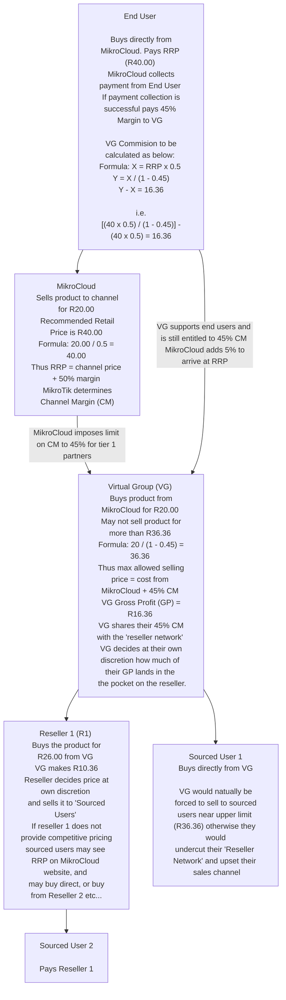

```mermaid
graph TD
    A["MikroCloud \n Sells product to channel for R20.00 \n Recommended Retail Price is R40.00 \nFormula: 20.00 / 0.5 = 40.00 \nThus RRP = channel price + 50% margin \n MikroTik determines Channel Margin (CM) "] -->|MikroCloud imposes limit on CM to 45% for tier 1 partners | B["Virtual Group (VG) \n Buys product from MikroCloud for R20.00 \n May not sell product for more than R36.36 \n Formula: 20 / (1 - 0.45) = 36.36 \n Thus max allowed selling price = cost from MikroCloud + 45% CM \n VG Gross Profit (GP) = R16.36 \n VG shares their 45% CM with the 'reseller network' \n VG decides at their own discretion how much of their GP lands in the \n the pocket on the reseller. "]
    B --> C["Reseller 1 (R1) \n Buys the product for R26.00 from VG \n VG makes R10.36 \n Reseller decides price at own discretion \n and sells it to 'Sourced Users' \n If reseller 1 does not provide competitive pricing\nsourced users may see RRP on MikroCloud website, and \n may buy direct, or buy from Reseller 2 etc..."]
B --> D["Sourced User 1\n Buys directly from VG \n \n VG would natually be forced to sell to sourced\nusers near upper limit (R36.36) otherwise they would\nundercut their 'Reseller Network' and upset their \n sales channel"]
    C --> E[Sourced User 2 \n \n Pays Reseller 1]

        F -->|VG supports end users and is still entitled to 45% CM \n MikroCloud adds 5% to arrive at RRP| B
       F["End User \n \n Buys directly from MikroCloud. Pays RRP (R40.00) \n MikroCloud collects payment from End User \n If payment collection is successful pays 45% Margin to VG \n \n VG Commision to be calculated as below: \nFormula: X = RRP x 0.5 \n Y = X / (1 - 0.45) \n Y - X = 16.36 \n \n i.e. \n [(40 x 0.5) / (1 - 0.45)] - (40 x 0.5) = 16.36 "] --> A
        

```
